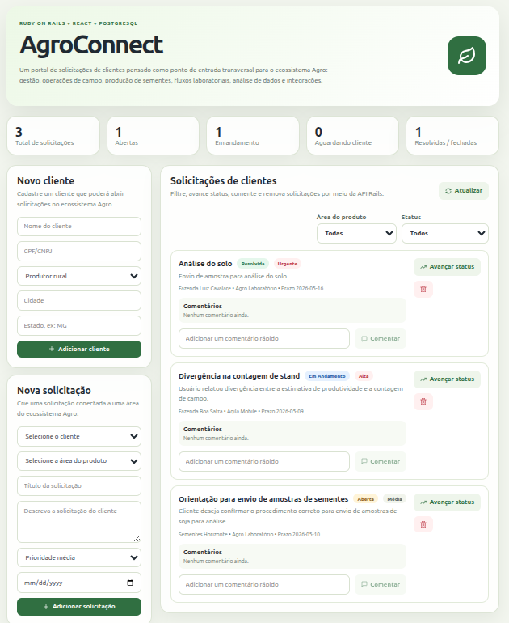
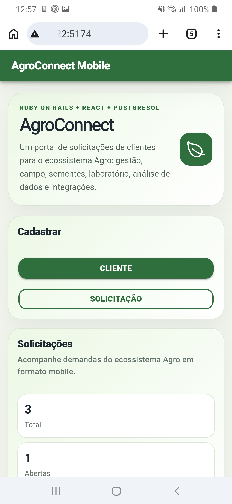
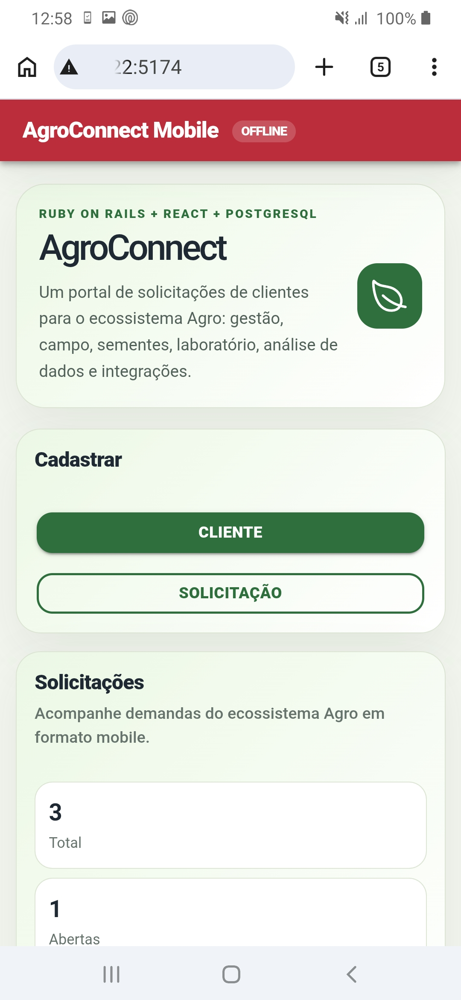
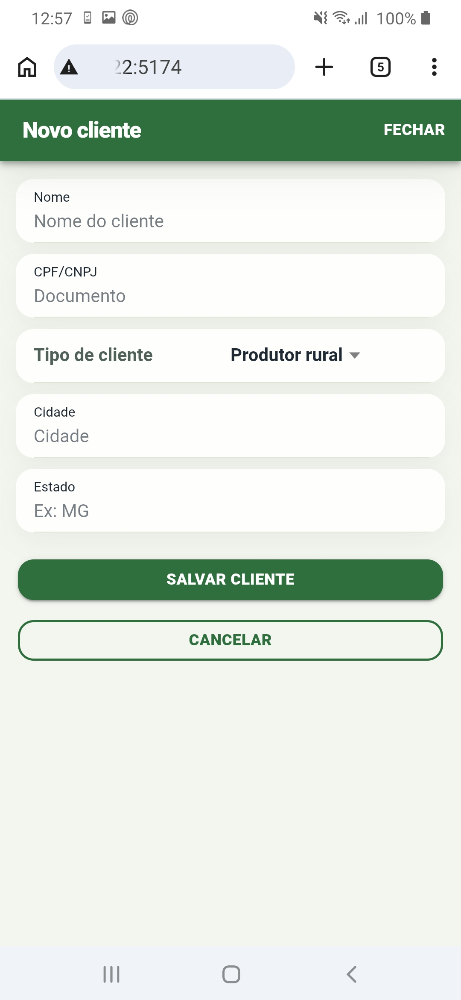
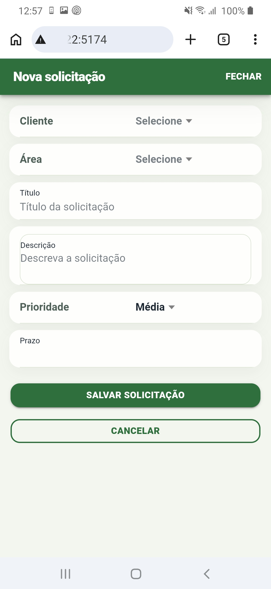
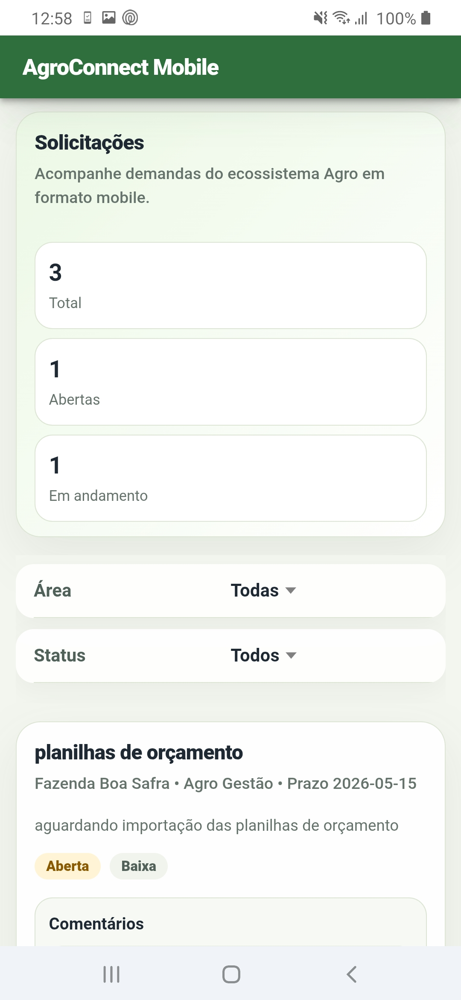
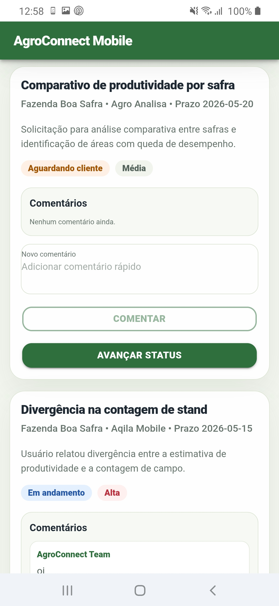

# AgroConnect

AgroConnect é uma aplicação fullstack desenvolvida para centralizar solicitações de clientes dentro de um ecossistema de soluções para o agronegócio.

O projeto é composto por uma API em Ruby on Rails, um backoffice web em React e uma versão mobile em Ionic React. A proposta é oferecer uma camada operacional simples para gerenciar clientes, áreas de produto, solicitações, status, prioridades e histórico de comentários em um único ecossistema.

A aplicação foi pensada a partir de um desafio comum em ambientes com múltiplos produtos: manter as interações com clientes organizadas quando as demandas podem envolver diferentes áreas de negócio, como gestão agrícola, operações de campo, gestão de sementes, serviços laboratoriais, análise de dados, integrações e suporte técnico.

## Visão Geral

O AgroConnect funciona como uma plataforma leve de gestão de solicitações para operações no agronegócio.

O backoffice web permite que uma equipe interna cadastre clientes, classifique solicitações por área de produto, acompanhe o status dos atendimentos, defina prioridades e mantenha um histórico de comunicação por meio de comentários.

A versão mobile foi criada com Ionic React para oferecer uma interface otimizada para dispositivos móveis, permitindo acompanhar solicitações, filtrar demandas, adicionar comentários, avançar status e cadastrar novos clientes e solicitações diretamente pela interface mobile.

O objetivo é oferecer uma base clara e extensível para um backoffice de atendimento e operações, que possa evoluir futuramente para uma plataforma mais ampla de suporte, onboarding, customer success ou acompanhamento de demandas em campo.

## Screenshots

### Backoffice Web



### Aplicativo Mobile

<div align="center">
  
  
  
</div>

<br />

<div align="center">
  
  
  
</div>

## Funcionalidades Principais

- Cadastro de clientes pelo backoffice web e pelo mobile
- Criação de solicitações pelo backoffice web e pelo mobile
- Catálogo de áreas de produto
- Listagem e filtragem de solicitações
- Acompanhamento de solicitações por status
- Filtro por área de produto
- Classificação por prioridade
- Fluxo de progressão de status
- Comentários e histórico de interações
- Exclusão de solicitações com confirmação
- Cards de resumo no dashboard
- Notificações via snackbar no front web
- Notificações via toast no mobile
- Interface mobile com Ionic React
- Pull to refresh na versão mobile
- Endpoint de health check da API

## Stack Tecnológica

### Backend

- Ruby on Rails API-only
- PostgreSQL
- Active Record
- API RESTful em JSON
- Service Object para regra de progressão de status
- Testes automatizados com a estrutura nativa do Rails

### Frontend Web

- React
- TypeScript
- Vite
- CSS
- Lucide React
- Vitest
- Testing Library

### Mobile

- Ionic React
- TypeScript
- Vite
- Capacitor
- CSS
- Vitest
- Testing Library

### Infraestrutura

- Docker
- Docker Compose
- Hot reload em ambiente de desenvolvimento para backend, frontend web e mobile

## Arquitetura

O AgroConnect utiliza uma arquitetura fullstack desacoplada:

```text
React + TypeScript SPA          Ionic React Mobile
          ↓ HTTP/JSON                    ↓ HTTP/JSON
              Ruby on Rails API
                       ↓ Active Record
                    PostgreSQL
```

O frontend web é responsável pela interface de backoffice e consome o backend por meio de endpoints REST.

A versão mobile utiliza Ionic React para oferecer uma experiência otimizada para dispositivos móveis, consumindo a mesma API Rails utilizada pelo backoffice web.

O backend expõe uma API JSON, gerencia a persistência dos dados e aplica o fluxo principal das solicitações. O PostgreSQL armazena clientes, áreas de produto, tickets e comentários.

## Organização do Projeto

```text
agroconnect/
├── backend/          Ruby on Rails API
├── frontend/         Backoffice web em React + TypeScript
├── mobile/           App mobile em Ionic React + Capacitor
└── docker-compose.yml
```

## Modelo de Domínio

A aplicação é organizada em torno de quatro entidades principais:

- **Cliente**: representa um cliente para o qual se pode abrir solicitações.
- **Área de Produto**: representa uma área de negócio ou linha de produto dentro do ecossistema agro.
- **Solicitação**: representa uma demanda de cliente relacionada a uma área de produto específica.
- **Comentário**: representa o histórico de interações de uma solicitação.

Principais relacionamentos:

```text
Cliente          → possui muitas Solicitações
Área de Produto  → possui muitas Solicitações
Solicitação      → pertence a um Cliente
Solicitação      → pertence a uma Área de Produto
Solicitação      → possui muitos Comentários
```

## Fluxo das Solicitações

As solicitações seguem um fluxo operacional simples:

```text
Aberta → Em Andamento → Aguardando Cliente → Resolvida → Fechada
```

Esse fluxo simula um processo básico de suporte ou operação, no qual as solicitações podem ser recebidas, tratadas, pausadas enquanto aguardam retorno do cliente, resolvidas e finalmente encerradas.

A regra de progressão de status foi extraída para um Service Object no backend:

```text
RequestTickets::AdvanceStatus
```

Essa abordagem mantém a regra de negócio fora do controller e facilita futuras evoluções, como auditoria, notificações, validações de transição ou controle de SLA.

## Como Executar o Projeto

### Requisitos

- Docker
- Docker Compose

### Executando a aplicação

A partir da raiz do projeto, execute:

```bash
docker compose up --build
```

Após os containers iniciarem, acesse:

```text
Backend health check: http://localhost:3000/api/v1/health
Frontend web:         http://localhost:5173
Mobile web preview:   http://localhost:5174
```

Resposta esperada do health check:

```json
{
  "status": "ok",
  "application": "AgroConnect API"
}
```

## Acessando o Mobile em Dispositivo Físico

Para testar a versão mobile em um celular físico, o dispositivo deve estar na mesma rede Wi-Fi da máquina que está executando o Docker.

Descubra o IP local da máquina:

```bash
hostname -I
```

Depois acesse no navegador do celular:

```text
http://SEU_IP_LOCAL:5174
```

Exemplo:

```text
http://192.168.1.22:5174
```

A API também precisa estar acessível pelo IP local:

```text
http://SEU_IP_LOCAL:3000/api/v1/health
```

No ambiente de desenvolvimento, o serviço mobile utiliza a variável `VITE_API_URL` para apontar para a API Rails.

Exemplo:

```text
VITE_API_URL=http://192.168.1.22:3000/api/v1
```

## Comandos de Desenvolvimento

Verificar containers em execução:

```bash
docker compose ps
```

Visualizar logs do backend:

```bash
docker compose logs -f api
```

Visualizar logs do frontend web:

```bash
docker compose logs -f frontend
```

Visualizar logs do mobile:

```bash
docker compose logs -f mobile
```

Subir apenas o backend e banco:

```bash
docker compose up db api
```

Subir apenas o frontend web:

```bash
docker compose up frontend
```

Subir apenas o mobile:

```bash
docker compose up mobile
```

Reconstruir apenas o mobile:

```bash
docker compose up --build mobile
```

Abrir o console do Rails:

```bash
docker compose exec api bundle exec ./bin/rails console
```

Listar rotas do Rails:

```bash
docker compose exec api bundle exec ./bin/rails routes
```

Recriar o banco de dados:

```bash
docker compose exec api bundle exec ./bin/rails db:drop db:create db:migrate db:seed
```

Executar verificação de tipos no frontend web:

```bash
docker compose exec frontend npm run lint
```

Executar verificação de tipos no mobile:

```bash
docker compose exec mobile npm run lint
```

## Testes Automatizados

O projeto possui cobertura básica de testes no backend, no frontend web e na versão mobile, com foco nas principais regras do fluxo de solicitações e na apresentação dos dados na interface.

### Backend

Os testes do backend utilizam a estrutura nativa de testes do Rails.

A cobertura inclui:

- Validação do fluxo de progressão de status das solicitações
- Testes do Service Object `RequestTickets::AdvanceStatus`
- Testes básicos de models
- Testes de endpoints principais da API

Executar todos os testes do backend:

```bash
docker compose exec api bundle exec rails test
```

Executar apenas os testes do fluxo de status:

```bash
docker compose exec api bundle exec rails test test/services/request_tickets/advance_status_test.rb
```

### Frontend Web

Os testes do frontend web utilizam Vitest e Testing Library.

A cobertura inclui:

- Validação dos formatadores de status e prioridade
- Testes de apresentação dos dados dos tickets
- Testes de interação em componentes
- Validação do fluxo de confirmação antes da exclusão de uma solicitação

Executar todos os testes do frontend web:

```bash
docker compose exec frontend npm run test
```

Executar os testes uma única vez:

```bash
docker compose exec frontend npm run test:run
```

Executar verificação de tipos no frontend web:

```bash
docker compose exec frontend npm run lint
```

### Mobile

Os testes da versão mobile utilizam Vitest e Testing Library.

A cobertura inclui:

- Validação dos formatadores de status e prioridade
- Renderização da tela mobile com dados mockados da API
- Validação da exibição de solicitações, status, prioridades e comentários
- Testes do modal de cadastro de clientes
- Testes do modal de cadastro de solicitações
- Validação de eventos de formulário, como alteração de campos, selects e datas
- Validação de ações de salvar, cancelar e fechar modais
- Validação de CPF/CNPJ no cadastro de clientes
- Uso de mocks centralizados para componentes Ionic, Capacitor Network, Ionicons e API

Executar todos os testes do mobile:

```bash
docker compose exec mobile npm run test
```

Executar os testes uma única vez:

```bash
docker compose exec mobile npm run test:run
```

Executar verificação de tipos no mobile:

```bash
docker compose exec mobile npm run lint
```

## Endpoints da API

```http
GET    /api/v1/health

GET    /api/v1/customers
POST   /api/v1/customers
DELETE /api/v1/customers/:id

GET    /api/v1/product_areas

GET    /api/v1/request_tickets
POST   /api/v1/request_tickets
PATCH  /api/v1/request_tickets/:id
PATCH  /api/v1/request_tickets/:id/advance_status
DELETE /api/v1/request_tickets/:id

POST   /api/v1/request_tickets/:request_ticket_id/ticket_comments
```

## Roadmap do Produto

O AgroConnect foi projetado como um MVP extensível. Possíveis próximos passos incluem:

- Autenticação e controle de acesso por perfil
- Visões separadas para clientes e equipes internas
- Atribuição de solicitações a usuários internos
- Monitoramento de SLA e prazos de atendimento
- Suporte a anexos, documentos e imagens
- Integrações com e-mail e notificações
- Métricas avançadas no dashboard
- Trilha de auditoria para alterações de status e comentários
- Busca, paginação e filtros avançados
- Quadro de tickets em formato Kanban
- Build Android/iOS com Capacitor
- Notificações push para acompanhamento de solicitações